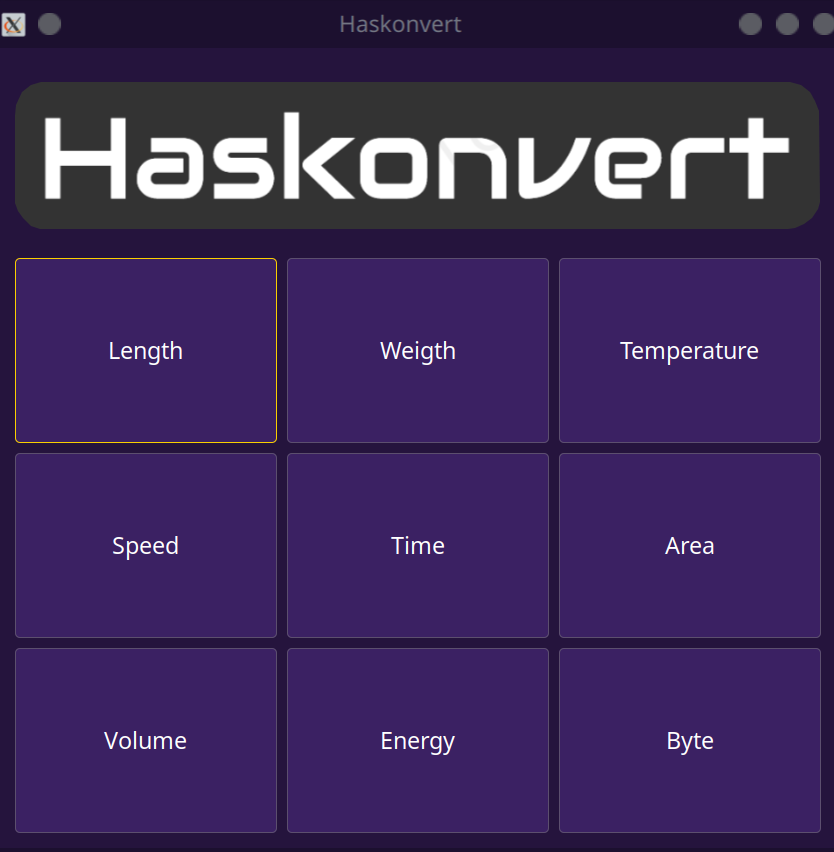
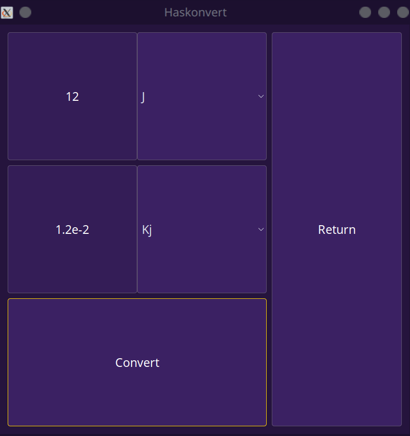

# Haskonvert

## Overview
A Haskell-powered unit converter with GTK, boasting advanced conversion features and customizable units.

The application offers conversion capabilities across nine distinct unit types:
- Length
- Weight
- Temperature
- Time
- Speed
- Area
- Volume
- Energy
- Bytes

## Image Gallery

<div align="center">
  
  
</div>

## Prerequisites

Before running this project, ensure that you have both Stack and the Glasgow Haskell Compiler (GHC) installed on your machine. If you haven't installed them yet, you can conveniently download and install both using GHCup, which is available at: 

- GHCup : [GHCup Download](https://www.haskell.org/ghcup/)

Make sure to follow the instructions provided on the website to complete the installation correctly.

## Executable

You can compile and run the program using the build and run commands of cabal.

```bash
stack run haskonvert
```

## Interpreter

You can open the Haskell interpreter (GHCi) using cabal with the project automatically loaded.

```bash
stack repl
```

## Tests

The project uses the [HUnit](https://hackage.haskell.org/package/HUnit) library for unit testing.

You can run the tests using the following command

```bash
stack test
```

If you want to run examples from the documentation as unit tests, use the [Doctest](https://hackage.haskell.org/package/doctest) library.

```bash
stack repl --build-depends=QuickCheck,doctest --with-ghc=doctest
```

## Documentation

You can generate documentation using [Haddock](https://haskell-haddock.readthedocs.io/).

```bash
stack haddock
```


